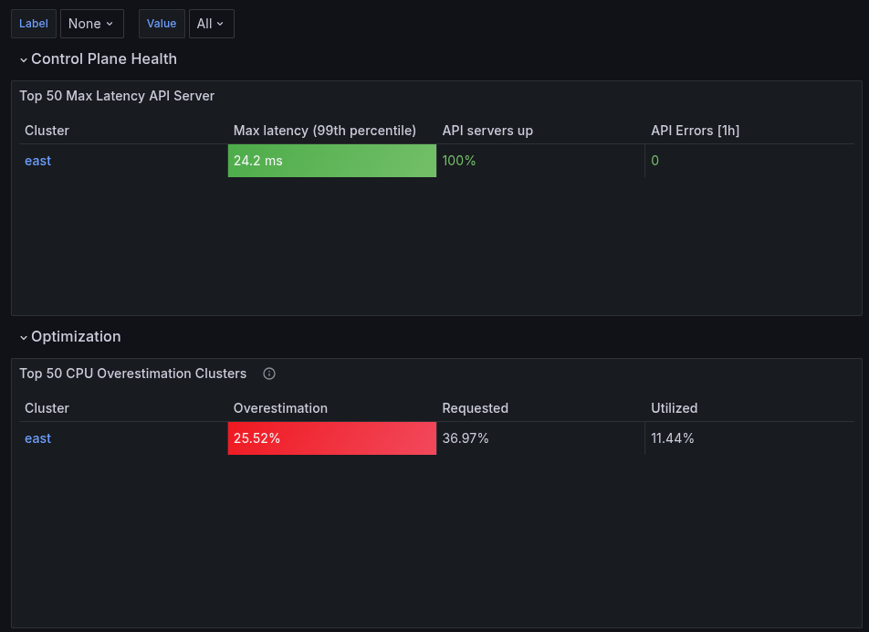
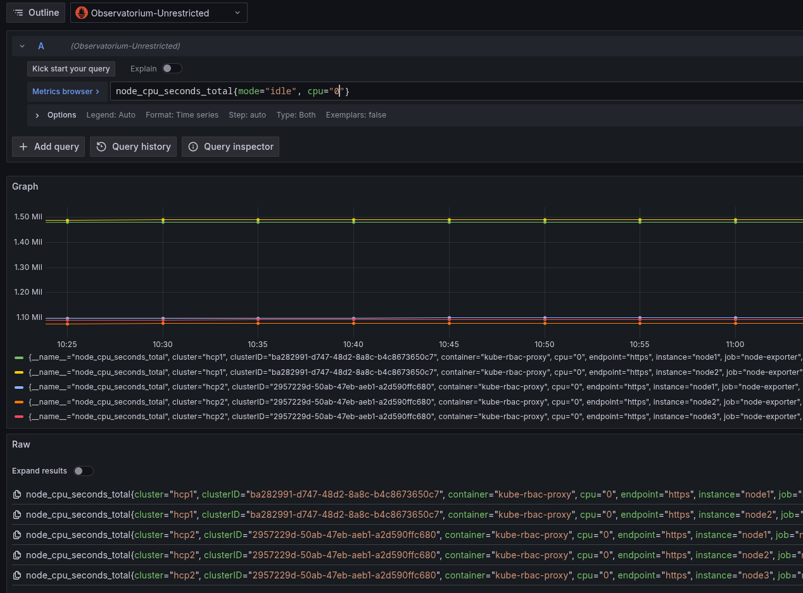
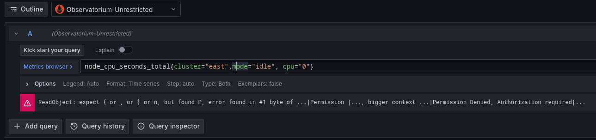

# Prometheus fine grained authorization proxy

The original POC was to show-case the possibility we can gain with utilizing state-of-the-art Authorization engines like [cerbos](https://cerbos.dev/). If you are looking for the use-case checkout the branch `simple-metric-filter` in the [policy repository](https://github.com/michaelalang/prom-policies).

Bumping the version to 3.x and fixing a ton of issue, I moved the use-case also closer to a real life scenario. 

## Red Hat OpenShift Advanced Cluster Observability

With the observability service enabled, you can use Red Hat Advanced Cluster Management for Kubernetes to gain insight about and optimize your managed clusters.

### Requirements

* Installed and working Red Hat Advanced Cluster Management (ACM)
* Installed and working ACM Observability (ACMO)
* Installed and working Red Hat Build of KeyCloak (RHBK)
* Installed and working Red Hat Directory Server (RHDS) or a similar LDAP service

## Concept

With the use-case of ACMO, the expectation is that a centralized Authentication service is in place. I haven't seen to many companies without. Furthermore and for flexibility, those User Objects are wrapped by a SSO Service providing a JWT with roles,groups,whatever.

For the grain in RBAC's I did want to show that flexibility and restrictions can be handled for metrics signal and there's one concept around since years you for sure have heard of already called [prom-label-proxy](https://github.com/prometheus-community/prom-label-proxy). 
Prom-label-proxy is also in use for OpenShift Container Platform (OCP) metrics and dashboards. 

Unfortunately, this concepts expects the enforced label (namespace) to be present and or injects it if not. This concept works but hits the border if you either have no `label` in your TSDB or if the `label` doesn't make sense at all (like for Alerts).

The original `simple-metric-filter` use-case removed that limitation but does require instead to write a lot of policies as labels might be different for many use-cases (think about dashboards for technologies like ArgoCD, envoy/istio, custom Dashboards ...)

With 3.x I started to `merge` those two concepts by getting labels enforced if requested in the headers. These enforced labels can than be pinned to various datasources and referenced in the dashboards where labels are present.

This combination makes sense and was brought to me by colleagues in Engineering (meaning the enforce required) even though I initially was against this path as it limits the implementation to a specific scenario and doesn't give us the option to use RBAC on any metrics signals.

Keeping the original idea of using JWT attributes for dynamically adjusting permissions on a per user base we now end up with following connections between the various components:

### LDAP 

LDAP User objects carry multiple attributes. In principal it doesn't matter which one you choose as long as they are not conflicting and are multi-value able
```
dn: cn=Tenant2,ou=People,dc=example,dc=com
uid: namespace2
member: east   # < used for mapping to JWT attribute cluster
l: ns1	       # < used for mapping to JWT attribute namespace
l: ns2
l: openshift-monitoring
l: default
l: openshift-etcd
memberOf: cn=Editor,ou=Groups,dc=example,dc=com       # < typically used for Group assignment like roles in Grafana
```

In the above example we are using all `member` attributes (here singleton of "east") to build the list of clusters that are allowed and,
using the attribute `l` (all values returned) to build the list of namespaces that are allowed and `memberOf` for Grafana permissions (as groups are typically used in posix I did not want to taint the list with unnecessary items)

### OIDC/SSO

RHBK uses the LDAP service to federate users and provide JWT tokens for passing attributes/roles around. The JWT attributes are linked to the filtered/enforced labels on the metrics meaning, a mapping of (let's say) `member` will be mapped to `cluster`. 
```
$ oidc | jq -r [.cluster,.namespace,.groups]
[
  [
    "east"
  ],
  [
    "ns1",
    "ns2",
    "openshift-monitoring",
    "default",
    "openshift-etcd"
  ],
  [
    "Editor",
    "offline_access",
    "uma_authorization",
    "default-roles-home"
  ]
]
```

### Grafana Datasources

As mentioned, enforcing what and when on the datasources removes the burden to adjust n^ dashboards with add or remove labels from queries depending on if they are useful or not.

As ACMO does inject the label of `cluster` the default Datasource `Observatorium` is enforcing only the `cluster` label on queries and filters accordingly on responses.

Further the datasources are extended to following:

* prometheus-enforce-cn, which enforces the labels `cluster` and `namespace` (typically on kubernetes pod/workload dashboards)
* prometheus-enforce-n, which enforces **only** the label `namespace` whenever `cluster` is not useful.
* prometheus-enforce-c, duplicate of `Observatorium` and useful if you do not want to use the default Datasource but require enforcement.
* Observatorium-Unrestricted, which does not enforce any label and is most useful on the metrics browser.


### Prom-policy Proxy 

The filter proxy itself has been improved to support `cerbos` as well as `OpenPolicyAgent` (OPA) and even though OPA is considered to be slower due to the nature of grpc vs http speed, the rego policy is included in the file `prompolicy.rego`.

Compared to release 1.x the filter on restrictions are now also retrieved from the header `x-enforce-label` which is a comma separated list of strings. The Principal created for the policy check now also retrieves all values and maps them in the policy as attributes to be checked.
```
# like checking if the requested cluster is in the principal cluster list 
request.resource.attr.cluster in request.principal.attr.cluster
```

This dynamic resolution concept makes it easy to re-use the policy until you need to be more specific for a specific set of users (like cluster=true and is_manager=true concepts).

# deploying fine grained RBAC to ACMO


to deploy the second instance of Grafana including fine grained RBAC permissions execute following commands:

* Ensure to adjust the `acm/grafana.ini` file to match the OIDC configuration of your deployment
* Ensure to adjust the `acm/grafana.ini` file URI's to your Domains accordingly
* Recreate the `adm/grafana-secret.yml` file by executing following command
```
oc -n open-cluster-management-observability create secret generic grafana-secret \
 --from-file=grafana.ini=acm/grafana.ini --dry-run=client -o yaml \
 > acm/grafana-config.yml
```

* Ensure to adjust the `acm/policycreds.yml` secret with the proper Git repository credentials to retrieve policies
* Ensure to adjust the `acm.route.yml` secret to match your grafana.ini URI's


* deploy the stack by executing following command
```
oc -n open-cluster-management-observabilty apply -k acm
```

## finishing the Grafana setup

With the original ACMO Grafana deployment a dashboard loaded is responsible to add the dashboards shipped. With the switch to OIDC and the lack of support of the loader we need to setup the dashboards manual which can be done in three ways:

* copy the `acm/grafana.db` SQLite database into the PVC mount accordingly
* enable the admin user and set a password to use the Dashboard or API to load all dashboards from the directory `grafana-dashboards`
* manually import the dashboards for every user from the directory `grafana-dashboards`

Once the dashboards are available we validate the RBAC's configured.


## Verification 


* Browse to your ACM Observability URI which includes the RBAC settings
* Login with a tenant and browse the Cluster Overview Page


* copy&paste the URI into a new Browser authenticating as another tenant


* repeat for as many clients as you have

* Select any other dashboard and compare the returned metrics accordingly.

* Open the Metrics Browser with a tenant that is restricted to a subset of Clusters

* Select `Observatorium-Unrestricted` as Prometheus datasource 
* Enter following query in the Metrics browser
```
node_cpu_seconds_total{mode="idle", cpu="0"}
```



* The Proxy filter will return a valid response but filters out all none cluster granted responses.
**NOTE** the response filter has it's limitation when it comes to sum of aggregations like in 
```
sum(rate(node_cpu_seconds_totla{mode="idle", cpu="0"}[2m]))
```
Reason is that the returned response from Prometheus does not have any indication of metric or labels but only values.

* To mitigate this you can switch/enforce the Prometheus source accordingly.

* Continue with the `Observatorium-Unrestricted` Datasource and enter following query in the Metircs browser
```
node_cpu_seconds_total{cluster="east",mode="idle", cpu="0"}  # a cluster name the tenant has no access to
```


